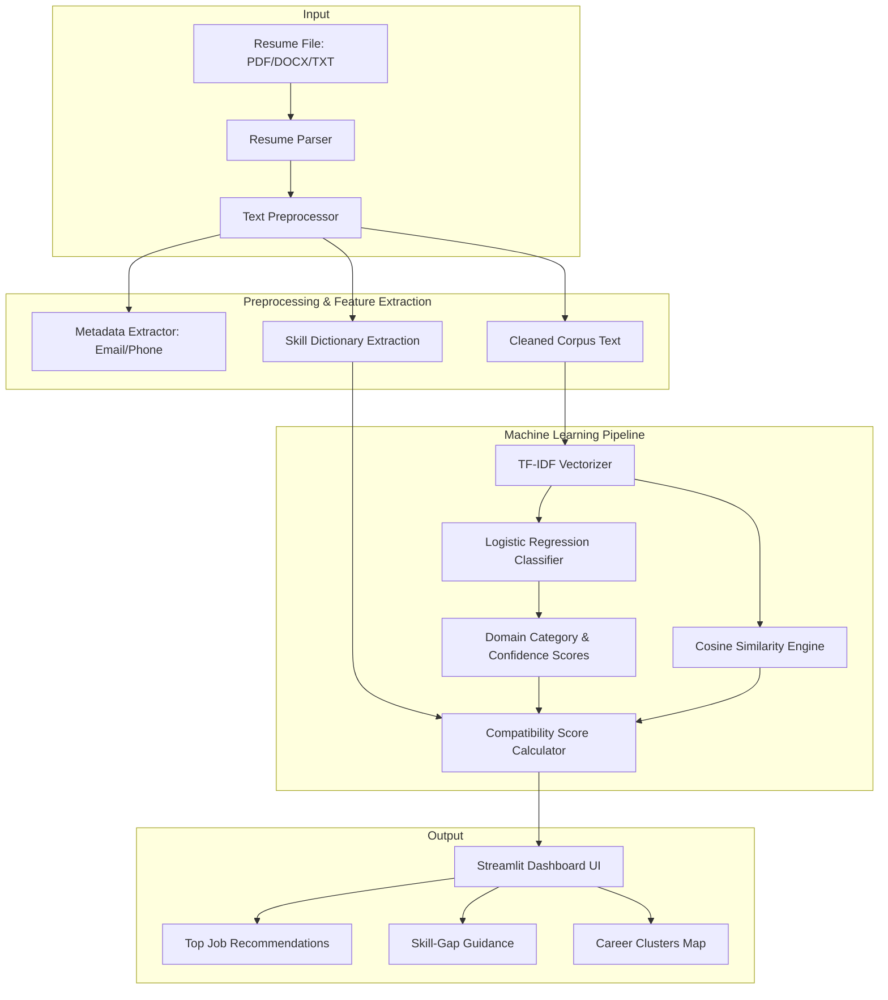

# SmartHire: Resume-to-Job Matching & Career Guidance System

🌐 **Live Demo**: [https://smarthire-ai-engine.streamlit.app/](https://smarthire-ai-engine.streamlit.app/)

SmartHire is an AI-powered end-to-end recruitment and career guidance platform. The system parses resumes, classifies them into specific job categories using classical Machine Learning, matches them against relevant job listings using Cosine Similarity, performs automated skill-gap analysis, and structures job postings using K-Means clustering.

---

## 🚀 Core Features

- **Resume Parsing**: Supports extracting structured text, email addresses, phone numbers, and matching skills from uploaded **PDF, DOCX, and TXT** resume files.
- **Resume Domain Classification**: Uses a trained **TF-IDF + Logistic Regression** pipeline to categorize candidate profiles into one of 6 domains (Software Engineering, Data Science, Frontend Development, DevOps, Product Management, and Human Resources).
- **Automated Recommender System**: Employs **Cosine Similarity** to compute a candidate-to-job compatibility percentage based on text similarity (50%), skill matching (30%), and classification category alignment (20%).
- **Skill-Gap Analysis & Upskilling Guides**: Flags missing skills required for recommended roles and recommends targeted courses, certifications, and project ideas.
- **Job Clustering (Unsupervised ML)**: Leverages **K-Means Clustering** to automatically map job postings to underlying categories based on raw description semantics.
- **Interactive Dashboard**: A beautiful, custom-designed **Streamlit Dashboard** equipped with visual analytics, candidate matching profiles, similar job recommendations, and an administration page to post new jobs and retrain models.

---

## 🛠️ Architecture & ML Pipeline



### Models Used:
1. **Logistic Regression (Supervised)**: Trains on candidate resume text representation using TF-IDF features (max_features=2500, unigrams and bigrams). Used to predict candidate career domain categories with probability distributions.
2. **Cosine Similarity (Vector Space)**: Evaluates semantic distance between candidate profile vectors and job description corpus vectors.
3. **K-Means Clustering (Unsupervised)**: Clusters jobs (K=6) based on job description semantics, automatically labeling clusters with their top centroids keywords to map related career paths.

---

## 📂 Project Structure

```
SmartHire/
├── data/                   # Generated/Saved datasets (raw_resumes.csv, raw_jobs.csv)
├── models/                 # Saved pickle model artifacts (classifier, vectorizer)
├── src/                    # Backend source code modules
│   ├── classifier.py       # Model training, evaluation, and inference classification
│   ├── clustering.py       # K-Means job clustering and path discovery
│   ├── data_generation.py  # Script to generate synthetic resumes and jobs dataset
│   ├── preprocessing.py    # Text cleaning, regex parsing, and skill extractors
│   └── recommender.py      # Recommendation engine and skill-gap analyzer
├── tests/                  # Unit test suite
│   └── test_pipeline.py    # Tests for preprocessing, ML models, and recommenders
├── app.py                  # Streamlit dashboard application UI
├── requirements.txt        # Project dependencies
├── .gitignore              # Files excluded from git tracking
├── LICENSE                 # MIT License file
└── README.md               # Project documentation
```

---

## ⚙️ Setup and Installation

### 1. Prerequisites
Ensure you have **Python 3.10+** and `pip` installed.

### 2. Install Dependencies
Clone the repository and install the required libraries:
```bash
pip install -r requirements.txt
```

### 3. Generate Datasets & Train Models
You can programmatically generate the synthetic data and pre-train the classification model by running:
```bash
# Generate datasets
python src/data_generation.py

# Train ML models
python -m src.classifier
```
*(Alternatively, you can generate datasets and train models directly from the Streamlit UI).*

### 4. Run Unit Tests
Verify the installation by running the unit test suite:
```bash
python -m unittest discover -s tests -p "test_*.py"
```

### 5. Launch the Streamlit App
Start the web dashboard locally:
```bash
streamlit run app.py
```
Open `http://localhost:8501` in your browser.

---

## 📄 License
This project is licensed under the MIT License - see the [LICENSE](LICENSE) file for details.
